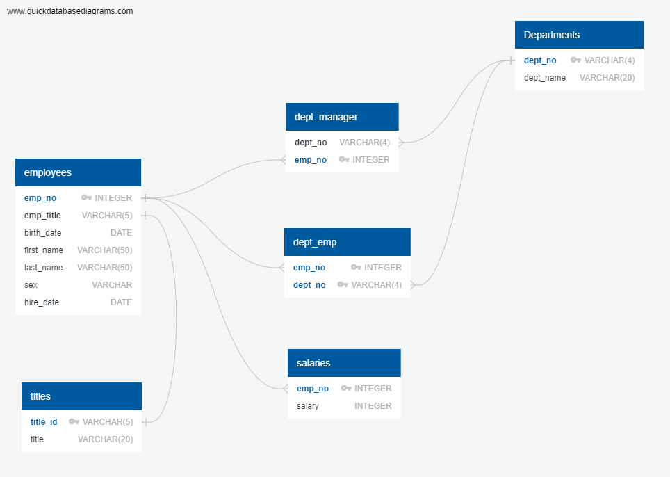
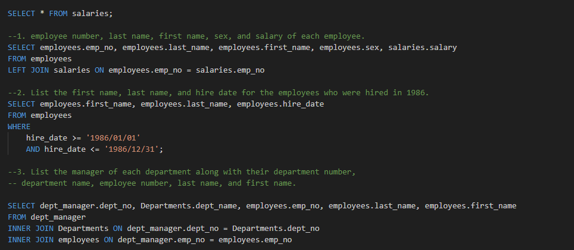

# Analyzing Historical Employee Data with SQL

# Summary

The problem: A major corporation needs to analyze employee data from the 1980s and 1990s, but the data is stored in six separate CSV files.

The solution: Design table schemas for the CSV files, import the data into a SQL database, and perform various data analysis tasks to extract insights. This involves data modeling, data engineering, and data analysis, including tasks like creating an Entity Relationship Diagram, defining table schemas, importing CSV files into SQL tables, and querying the database to answer specific questions about the data.

# Entity Relationship Diagram:

# Sample Queries:

# File Information:

All necessary files and/or folders are inside of the EmployeeSQL folder.

-The file labeled sql_challenge_results contains all of the solution code 
 for this sql challenge. 

-Entity relationship diagram is included as a PNG file, and labeled entity_relationship_diagram. 

-Excel csv data sheets are inside of the data folder. 
